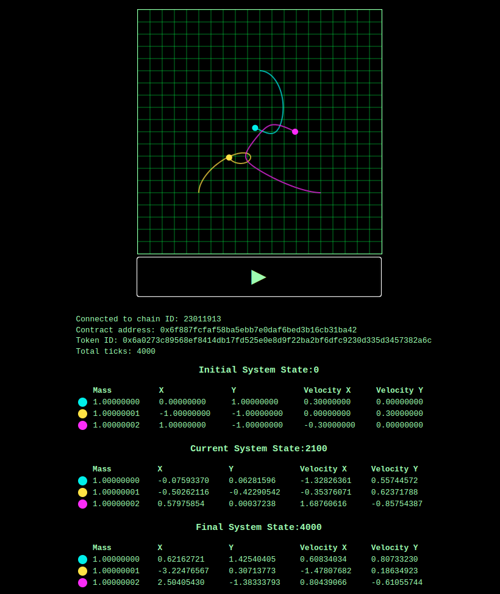

<p align="center">
  
</p>

[Arbitrum Stylus](https://docs.arbitrum.io/stylus/stylus-gentle-introduction) allows developers to write smart contracts in any language that can compile to WASM. This project explores Stylus by implementing a erc721 compatible NFT.

The NFTs, written using the [rust-stylus-sdk](https://github.com/OffchainLabs/stylus-sdk-rs), represent the paths traveled by ***n*** massive bodies in a gravitational field. The trajectories are calculated an executed on-chain.

The project also includes a web interface for viewing the trajectories which executes the same rk4 code natively in browser.

:warning: **Warning**: This smart contract code is a demo and a WIP. It is not for production use and has not been audited. Use at your own risk.

<p align="center">
  
</p>

### Features:
- [ ] Erc721 compatible (Incomplete)
- [x] Rk4 integer implementation in Rust
- [x] Test suite producing png plots for rk4
- [x] Web interface and web wasm bindings for viewing the NFTs
- [ ] Gas costs breakdown (TODO)
- [ ] Optimization of the rust implementation (TODO)
- [ ] Solidity implementation (TODO)
- [ ] Run solidity rk4 implementation in the browser using ethereumjs (TODO)
- [ ] Erc721 tests (TODO)
- [ ] Integrated tests - at the moment main.rs needs to be commented out in order to run tests (TODO)
- [ ] Other remaining TODOs in code (TODO)

## Motivation
The project is an exploration of how to write a simple NFT project in rust that will run on Arbitrum Stylus. Amongst other things [Arbitrum Stylus offers](https://docs.arbitrum.io/stylus/stylus-gentle-introduction) up to 10x cheaper computation gas costs and up to 100x cheaper memory gas costs. Minting the NFT requires computing the trajectory of n massive bodies in a gravitational field using rk4. The accuracy of rk4 is bound by computation, so Stylus providing access to cheaper computation offers us the ability to compute the trajectories more accurately than we could on the EVM.

## Background
In the general case, the motion of more than two bodies interacting gravitationally does [not have a known analytical solution](https://en.wikipedia.org/wiki/N-body_problem). However, the motion of the bodies can be estimated using numerical methods, such as [Runge-Kutta](https://en.wikipedia.org/wiki/Runge%E2%80%93Kutta_methods).
See also, [this python project](https://github.com/kirklong/ThreeBodyBot) which has an excellent background and description of the problem.

### Dependencies
* [Cargo stylus CLI](https://github.com/OffchainLabs/cargo-stylus)

### Tests
Run `./scripts/test.sh` to run the tests. This will update the plots in `./test_plots`, so you can try deleting them and see that they get recreated.

### Deployment
Set a private key environment variable
```sh
PRIV_KEY=<private key>
```
Then run the deploy script
```
./scripts/deploy.sh
```
A pre-deployed nft contract is available at `0x6f887fcfaf58ba5ebb7e0daf6bed3b16cb31ba42` on the stylus testnet.

### Mint an NFT
The `mint` script allows to set the initial parameters for n bodies. One configuration called "our separate ways" is pre-configured, comment in/out other configurations to mint them.
Some important points to note:
* Bodies are identified by their mass, and so must be unique
* Precision is set at 8 decimal places. So choosing values on the order of 1\*10^8 is the best choice. The window in the UI only shows out to about +/-2\*10^8 
* If using the pre-deployed contract, the preset configurations have likely already been minted, so will revert since each set of initial conditions is unique.

Once a configuration has been chosen run, set the following environment variables.
```
RPC_URL=https://stylus-testnet.arbitrum.io/rpc
PRIV_KEY=<priv key>
```
Then run the script, passing in the address of the deployed contract as an argument.
```sh
./script/mint.sh <nft-address>
```
The token id is shown as the second topic in the second log of the result.
To find it, do the following:
1. Scroll down to the logs field, which is an array
2. Look for the second object in the array
3. Look for the `topics` field in that second object, this field is also an array value
4. Copy the second value in the array, it should be a 32 byte hex string. Eg. `0x6a0273c89568ef8414db17fd525e0e8d9f22ba2bf6dfc9230d335d3457382a6c`


## Running the web app
The web app allows you to visualise the NFT trajectories that were calculated on chain. It runs some of exact same code that is executed in the smart contract, but instead runs it in the browser. To begin you need to build the wasm bindings for the rk4 code.
```
./scripts/publish-wasm.sh
```

Next you can start a local server using miniserve
```
cargo install miniserve
miniserve web
```

Then navigate to the `view.html` page in the browser. You will need set three URL parameters:
* `provider` - a url to the stylus node. Eg. `https://stylus-testnet.arbitrum.io/rpc`
* `address` - address of the deployed NFT contract. Eg.`0x6f887fcfaf58ba5ebb7e0daf6bed3b16cb31ba42`
* `tokenId` - the token id for your minted token. Eg. `0x6a0273c89568ef8414db17fd525e0e8d9f22ba2bf6dfc9230d335d3457382a6c`

```
http://localhost:8080/view.html?provider=<rpc-url>&address=<contract-address>&tokenId=<token-id>
```

Example filled in URL:
```
http://localhost:8080/view.html?provider=https://stylus-testnet.arbitrum.io/rpc&address=0x6f887fcfaf58ba5ebb7e0daf6bed3b16cb31ba42&tokenId=0x6a0273c89568ef8414db17fd525e0e8d9f22ba2bf6dfc9230d335d3457382a6c
```