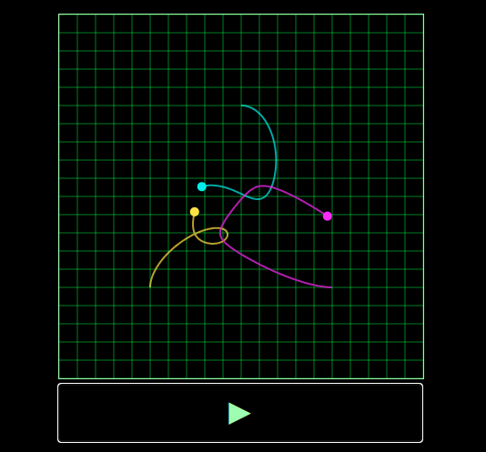

  

[Arbitrum Stylus](https://docs.arbitrum.io/stylus/stylus-gentle-introduction) allows developers to write smart contracts in any language that can compile to WASM. This project explores Stylus by implementing a erc721 compatible NFT.

The NFTs, written using the [rust-stylus-sdk](https://github.com/OffchainLabs/stylus-sdk-rs), represent the paths traveled by ***n*** massive bodies in a gravitational field. The trajectories are calculated an executed on-chain.

The project also includes a web interface for viewing the trajectories which executes the same rk4 code natively in browser.

:warning: **Warning**: This smart contract code is a demo and a WIP. It is not for production use and has not been audited. Use at your own risk.

  

### Features:
- [ ] Erc721 compatible (Incomplete)
- [x] Rk4 integer implementation in Rust
- [x] Test suite producing png plots for rk4
- [x] Web interface and web wasm bindings for viewing the NFTs
- [ ] Solidity implementation for comparing gas costs (TODO)
- [ ] Run solidity rk4 implementation in the browser using ethereumjs (TODO)
- [ ] Erc721 tests (TODO)
- [ ] Integrated tests - at the moment main.rs needs to be commented out in order to run tests (TODO)
- [ ] Other remaining TODOs in code (TODO)

## Motivation
The project is an exploration of how to write a simple NFT project in rust that will run on Arbitrum Stylus. Amongst other things [Arbitrum Stylus offers](https://docs.arbitrum.io/stylus/stylus-gentle-introduction) up to 10x cheaper computation gas costs and up to 100x cheaper memory gas costs. Minting the NFT requires computing the trajectory of n massive bodies in a gravitational field using rk4. The accuracy of rk4 is bound by computation, so Stylus providing access to cheaper computation offers us the ability to compute the trajectories more accurately than we could on the EVM.

## Background
In the general case, the motion of more than two bodies interacting gravitationally does [not have a known analytical solution](https://en.wikipedia.org/wiki/N-body_problem). However, the motion of the bodies can be estimated using numerical methods, such as [Runge-Kutta](https://en.wikipedia.org/wiki/Runge%E2%80%93Kutta_methods).
See also, [this python project](https://github.com/kirklong/ThreeBodyBot) which has an excellent background and description of the problem.

### Dependencies
* [Cargo stylus CLI](https://github.com/OffchainLabs/cargo-stylus)

### Tests
Run `./scripts/test.sh` to run the tests. This will update the plots in `./test_plots`, so you can try deleting them and see that they get recreated.

### Deployment

